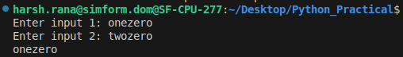
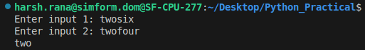
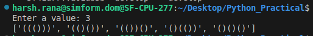
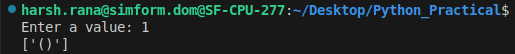
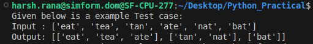
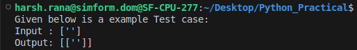
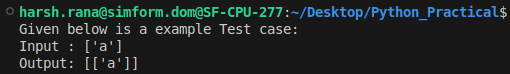

# Python Practical

### Problem: 1 [GCD of two numbers](gcd_two_numbers.py)

Used the euclidean algorithm for calculating the GCD.

Outputs:

Time Complexity:

`O(L + log min(n,m) + D)`

Here L is the length of the input word strings, n and m are the two numbers ,and D is the number of digits in the GCD result.

### Problem: 2 [Generate Parentheses](generate_parentheses.py)

Generating valid parentheses through backtracking.

Outputs:

Time Complexity:

`O(2^n)`

Here their would be exponential growth relative to n for the backtracking algorithm in the worst case.

### Problem: 3 [Group Anagrams](group_anagrams.py)

Outputs:

Time Complexity:

`O(m * n log(n))`

Here m is the number of strings in list and n is the average length each string to be sorted.
